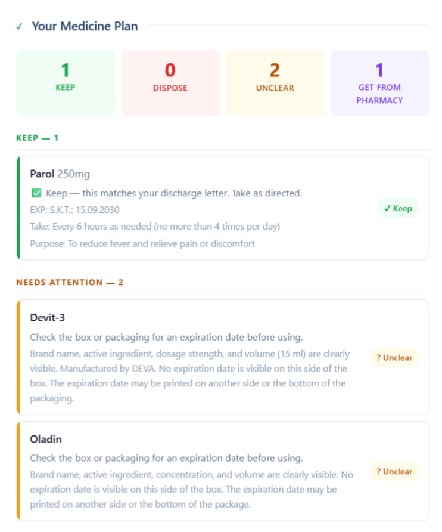
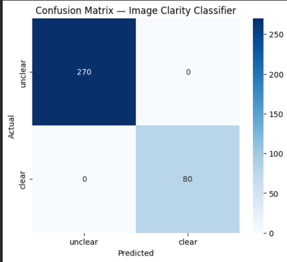
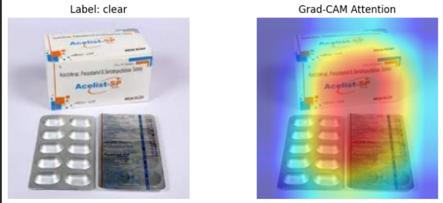

# 🏥 Cabinet Clear

**Understand your discharge letter. Know exactly what to keep, take, or throw away.**

Built for USAII's Global AI Hackathon 2026 — Challenge 1: *Help Is Hard to Find* (Direction A: Crisis-to-Action Translator)

> It's 11 p.m. Maya, 9, is finally asleep after an asthma flare-up. Her dad is sitting at the kitchen table with a discharge letter full of dosing instructions in one hand and a drawer of old inhalers and amoxicillin bottles in the other, trying to figure out which ones are safe to use tonight and which ones have been expired since last winter. Cabinet Clear is built for that exact moment.

<p align="center">
  
</p>

---

## The Problem

Every year, families leave the hospital with a discharge letter full of medical jargon and a medicine cabinet full of bottles they're not sure about. People miss doses, take expired medication, or skip follow-ups — not from carelessness, but because the information was never designed for someone exhausted and stressed.

**Cabinet Clear turns that chaos into a clear, actionable plan in under two minutes.**

---

## What It Does

📄 **Read any discharge letter** — paste text, upload a PDF, or snap a photo. Get a plain-language summary: diagnosis, medications, follow-ups, and warning signs ranked by urgency.

📸 **Scan your medicine cabinet** — photograph each bottle's label and expiration date. A custom-trained CNN checks photo clarity *before* extraction even runs, so blurry shots get caught immediately.

🔍 **Cross-reference everything** — fuzzy brand-to-generic matching (Tylenol → Acetaminophen) backed by real FDA drug data, so the system isn't fooled by OCR typos or brand names.

⚕️ **Catch what a tired parent might miss** — automatic drug interaction warnings between medications you're keeping.

📋 **Walk away with a plan** — every medicine sorted into **Keep**, **Dispose**, **Unclear**, or **Get from Pharmacy**, plus a downloadable PDF summary to bring to your pharmacist.

📱 **Installable as a phone app** — PWA support means it lives on your home screen, no app store required.

🔐 **Save your history** — sign in to keep a record of past discharge letters and cabinet checks, so you can compare visits over time. Passwords are hashed with bcrypt before storage; nothing is ever saved in plain text.

---

## Why AI, Not Just a Search Engine

A general chatbot can explain medical terms. It can't tell you that the Ibuprofen bottle in your cabinet matches your discharge prescription *but expired eight months ago*, or that two of your "keep" medications have a known interaction. That requires cross-referencing structured data from two different unstructured sources in real time — which is exactly what this pipeline is built to do.

---

## Architecture

```
┌─────────────────────┐         ┌──────────────────────┐
│  Discharge Letter    │         │   Medicine Photo      │
│  (text / PDF / image)│         │   (front + expiry)    │
└──────────┬───────────┘         └───────────┬───────────┘
           │                                  │
           ▼                                  ▼
   Claude multimodal extraction      Custom CNN clarity gate
   → structured JSON                 (ResNet18 + Grad-CAM)
   (meds, follow-ups,                         │
    warning signs)                   clear? ──┴── unclear?
           │                            │            │
           │                            ▼            ▼
           │                  Claude label      "Retake photo"
           │                  extraction        prompt
           │                  (name, dosage,
           │                   expiry date)
           │                            │
           ▼                            ▼
   ┌─────────────────────────────────────────┐
   │     Deterministic Cross-Reference Engine  │
   │  • Brand→generic canonicalization (FDA)   │
   │  • Fuzzy OCR-typo correction               │
   │  • Expiration check                        │
   │  • Drug interaction lookup                 │
   └───────────────────┬───────────────────────┘
                        ▼
        Keep / Dispose / Unclear / Get from Pharmacy
                        │
                        ▼
              Plain-language UI + PDF export
```

---

## AI Components

| Component | What it does | Built with |
|---|---|---|
| **Image clarity classifier** | Determines if a medicine photo is sharp enough to trust before extraction runs | Custom-trained ResNet18 (PyTorch), 1,748 images, transfer learning |
| **Explainability layer** | Visualizes *which part* of a label the model is evaluating | Grad-CAM |
| **Letter extraction** | Reads discharge letters in any format, returns structured plain-language summary | Claude API (Anthropic) |
| **Label extraction** | Reads drug name, dosage, and expiration date from photos | Claude API (Anthropic) |
| **Urgency scoring** | Ranks warning signs by how urgently they require action | Claude API + structured prompting |
| **Brand/generic resolution** | Maps "Tylenol" → "Acetaminophen" even with OCR typos | OpenFDA drug label data + fuzzy string matching |
| **Drug interaction check** | Flags risky combinations among kept medications | Static clinical reference + OpenFDA interaction data |
| **Cross-reference engine** | Deterministic rules engine — the safety-critical decision layer | Custom Python logic |

**Why deterministic rules for the final decision layer?** Medical safety decisions shouldn't depend on a model that can hallucinate. The LLM handles language understanding (reading messy documents); a transparent, auditable rules engine handles the actual Keep/Dispose logic. This is intentional, not a limitation.

---

## Responsible AI

**🎯 The AI never decides whether to take, stop, or change a medication.** That stays with a doctor or pharmacist — always. The AI only organizes information that's already written down and checks objective facts like expiration dates.

**⚠️ Known risk — extraction errors and hallucination:** The Claude extraction layer reads unstructured text and images, which means it can misread a drug name, invent a detail that isn't actually on the label, or misjudge an ambiguous expiration date format. This is the single biggest risk in the pipeline, because a wrong "Keep" or "Dispose" classification has real consequences.

**🛡️ Mitigation — confidence-gated routing, not blind trust:**
- Every extraction call is prompted to return a `confidence` rating (high / medium / low) and to flag anything it found unclear, rather than silently guessing.
- **Low-confidence results never reach the Keep or Dispose buckets.** The cross-reference engine routes them straight to "Unclear — ask your pharmacist," regardless of what the AI extracted. A wrong-but-confident-looking answer is treated the same as a missing one.
- The custom CNN clarity gate runs *before* extraction is even attempted on a photo — unclear images are rejected immediately with a Grad-CAM visualization showing exactly what was unreadable, so a bad read never enters the pipeline in the first place.
- The final Keep/Dispose decision itself is made by a **deterministic, auditable Python rules engine** — not the LLM. The LLM's job is limited to reading messy input into structured fields; it does not get the final say on what happens to any medication.
- The original extracted text is always shown alongside the AI's summary so the user can sanity-check it against the source document.

This is a defense-in-depth approach: no single layer is trusted to be right on its own.

---

## The CNN, In Depth

This is the one piece of the pipeline that's a genuinely custom-trained neural network rather than an API call, so it's worth explaining properly.

### The problem it solves

Before any AI tries to *read* a medicine label, something needs to answer a simpler question first: **is this photo even good enough to read?** A blurry, dark, or too-far-away photo of a label can cause downstream extraction to silently misread a drug name or, worse, an expiration date — and a wrong expiration date is exactly the kind of error that has real consequences in this app. So instead of trusting every photo equally, every medicine photo passes through a dedicated clarity classifier first.

### Why this is classification, not segmentation

It's tempting to reach for architectures like U-Net or ResUNet for any "real" computer vision project, but those are built for *segmentation* — outlining a specific region pixel-by-pixel (e.g. tracing a tumor boundary in a scan). That's the wrong tool here. "Is this photo clear or blurry?" is a **binary classification** problem — one label per image, not a pixel map — so the right architecture is a standard CNN classifier, not a segmentation network. Using the wrong architecture on purpose just to look more advanced would have made the model heavier and harder to train for no real benefit, so we used the architecture that actually matches the task.

### Model architecture

- **Base model:** ResNet18, pretrained on ImageNet
- **Transfer learning approach:** the early convolutional layers are frozen (they already know general image features like edges and textures), and only the final block (`layer4`) plus a new classification head are fine-tuned on our data
- **Classification head:** a single linear layer down to 1 output, passed through a sigmoid, giving a probability between 0 (unclear) and 1 (clear)
- **Loss function:** Binary Cross-Entropy (BCELoss) — the correct loss for a binary classification problem with a sigmoid output
- **Optimizer:** Adam, learning rate 1e-4, applied only to the unfrozen parameters

### Dataset and training

| | |
|---|---|
| **Base images** | 437 medicine packaging photos (public dataset) |
| **Augmentation** | Each base "clear" image was used to generate 3 "unclear" variants: Gaussian blur, brightness reduction (simulating poor lighting), and downscale-then-upscale (simulating a photo taken too far away) |
| **Total dataset** | 1,748 images (437 clear + 1,311 unclear) |
| **Train / validation split** | 1,398 / 350 (80/20) |
| **Epochs** | 8 |
| **Hardware** | Google Colab Pro, T4 GPU |

### Results

```
              precision    recall   f1-score
   unclear        1.00      1.00      1.00
     clear        1.00      1.00      1.00
```

<p align="center">
  
</p>

**Being honest about what this number means:** a perfect validation score on a dataset built from augmented copies of the same source images is expected to look better than it would on fully independent real-world photos, because the model can partly learn "this looks like a blurred/darkened variant of something I trained on" rather than purely general blur/clarity detection. We're stating this directly rather than presenting the headline number without context. In live testing during development, the classifier did correctly reject genuinely blurry photos taken fresh on a phone camera — but a larger, independently-collected test set is the natural next step to validate this more rigorously.

### Explainability with Grad-CAM

Training a model that gets the right answer isn't the same as knowing *why* it got the right answer. We used Grad-CAM (Gradient-weighted Class Activation Mapping) to visualize which pixels the model is actually paying attention to when it makes a prediction.

<p align="center">
  
</p>

This matters because a model can sometimes get the right answer for the wrong reason — for example, learning to associate "tabletop texture" or "lighting conditions" with the clear/unclear label instead of actually evaluating the legibility of the text. The Grad-CAM output above shows the model's attention (warm colors = high attention) concentrated directly on the printed text areas of the label, not the background or the pill blister pack — which is the evidence that it learned the right thing.

### Where the CNN sits in the pipeline

The clarity check runs as a **gate**, before any text extraction is attempted:

```
medicine photo → CNN clarity check
                        │
              clear?  ──┴──  unclear?
                │              │
                ▼              ▼
        proceed to AI    reject + show
        label extraction  Grad-CAM overlay,
                          ask for retake
```

If a photo is rejected, the user sees the Grad-CAM heatmap directly in the app, so they can see *which part* of the image was the problem (usually the expiration date area, since it's often a separate, lower-contrast stamp on the packaging) and retake just that shot.

---

## Tech Stack

**Backend:** FastAPI · PyTorch · torchvision · Grad-CAM · thefuzz · fpdf2
**Frontend:** Vanilla HTML/CSS/JS · PWA (installable)
**AI:** Claude API (Anthropic) · Custom ResNet18 CNN
**Data:** OpenFDA drug label API · synthetic discharge letters · self-collected training images

---

## Project Structure

```
cabinet-clear/
├── backend/
│   ├── app.py                  # FastAPI server, all endpoints
│   ├── extraction.py           # Discharge letter extraction + urgency scoring
│   ├── medicine_extraction.py  # Medicine label extraction
│   ├── crossreference.py       # Fuzzy matching + cross-reference engine
│   ├── interaction_checker.py  # Drug interaction detection
│   ├── clarity_checker.py      # CNN inference + Grad-CAM
│   ├── pdf_generator.py        # PDF summary export
│   ├── database.py             # Account + history storage (SQLite, bcrypt)
│   ├── clarity_model.pth       # Trained CNN weights
│   ├── drug_db.json            # FDA brand→generic mappings
│   └── requirements.txt        # Python dependencies
├── frontend/
│   ├── index.html              # Full app UI (incl. sign in / sign up)
│   ├── manifest.json           # PWA config
│   └── sw.js                   # Service worker
└── sample_data/
    └── discharge_letters/      # Synthetic test letters (txt/pdf/png × 5 scenarios)
```

---

## Running It On Your Own Computer

This section is written from real setup experience, including the snags we actually hit — following it in order should save you the troubleshooting we went through.

### 1. Prerequisites

- **Python 3.11 or 3.12** (not 3.13+, and not 3.14). PyTorch's Windows binaries are not reliably compatible with the newest Python releases yet — using 3.14 specifically caused a `DLL initialization failed` error loading `c10.dll` for us. Check what you have with `python --version`, and if you're on an unsupported version, install 3.12 from [python.org](https://www.python.org/downloads/) (or via the Python Install Manager: `py install 3.12`) — multiple versions can coexist on the same machine.
- **Windows only — Microsoft Visual C++ Redistributable.** PyTorch's compiled C++ core (yes, PyTorch is partly written in C++ under the hood) needs this Windows system library to load. If you hit a DLL error even on a supported Python version, install it from [aka.ms/vs/17/release/vc_redist.x64.exe](https://aka.ms/vs/17/release/vc_redist.x64.exe), then **restart your computer** — this step matters, DLL loading issues often need a fresh process to take effect.
- **An Anthropic (Claude) API key** — get one at [console.anthropic.com](https://console.anthropic.com).
- A stable internet connection for the initial install — PyTorch alone is roughly 120MB to download.

### 2. Clone the repo and set up a virtual environment

```bash
git clone https://github.com/<your-username>/cabinet-clear.git
cd cabinet-clear/backend
```

**Windows (PowerShell):**
```powershell
py -3.12 -m venv venv
.\venv\Scripts\Activate.ps1
python --version   # should print Python 3.12.x — confirm before continuing
```

**Mac/Linux:**
```bash
python3.12 -m venv venv
source venv/bin/activate
python --version
```

Your terminal prompt should now show `(venv)` at the start of the line. **Every time you open a new terminal to work on this project, you need to reactivate the venv** with the same command above — it does not stay active across terminal sessions.

### 3. Install dependencies

```bash
pip install -r requirements.txt
```

This installs FastAPI, PyTorch, torchvision, Grad-CAM, and everything else. It will take a few minutes — torch and torchvision alone are well over 100MB combined. If a package download times out partway through (this can happen on slower connections), just re-run the same `pip install -r requirements.txt` command — pip skips what's already installed and resumes the rest.

### 4. Add your API key

Create a file called `.env` inside the `backend/` folder (note the leading dot — it won't show in some file explorers by default) with this single line:

```
ANTHROPIC_API_KEY=your_actual_key_here
```

This file is intentionally excluded from the repo via `.gitignore` — never commit a real API key to GitHub.

### 5. Verify the CNN loads correctly

Before starting the server, confirm PyTorch and the clarity model actually work on your machine:

```bash
python -c "from clarity_checker import check_clarity; print('imported ok')"
```

If this prints `imported ok`, you're good. If it throws a DLL error, go back to step 1 — it almost always means either the Python version or the Visual C++ Redistributable.

### 6. Run the server

```bash
uvicorn app:app --reload --port 8080
```

You should see `Uvicorn running on http://127.0.0.1:8080` with no errors underneath. **Keep this terminal window open the entire time you're using the app** — if it closes or the process stops, every feature will appear broken even though nothing is actually wrong with the code, since the frontend simply has no backend to talk to.

### 7. Open the app

Go to **http://localhost:8080/app** in your browser. On a phone on the same network, you can also install it to your home screen as a PWA directly from the browser menu.

---

## Disclaimer

Cabinet Clear organizes information only. It does not provide medical advice and does not replace consultation with a licensed doctor or pharmacist. Always confirm medication decisions with a healthcare professional.

---

*Built for USAII's Global AI Hackathon 2026, High School Track.*
